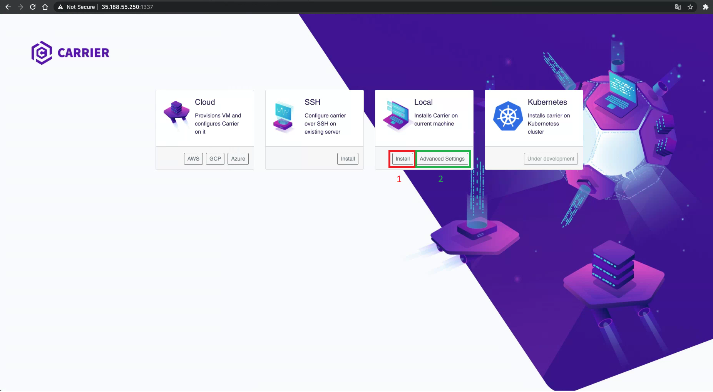
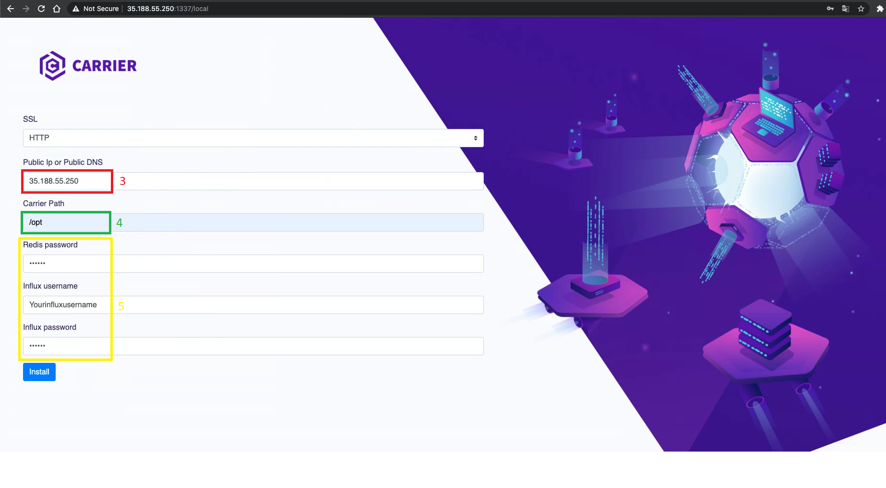
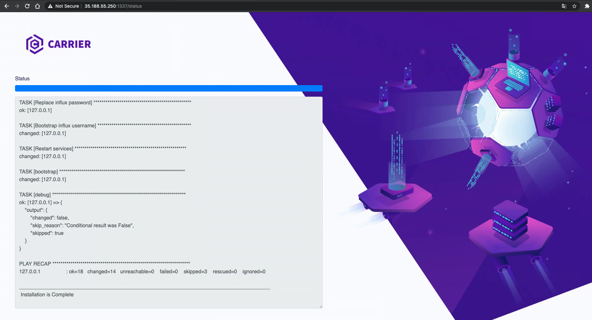
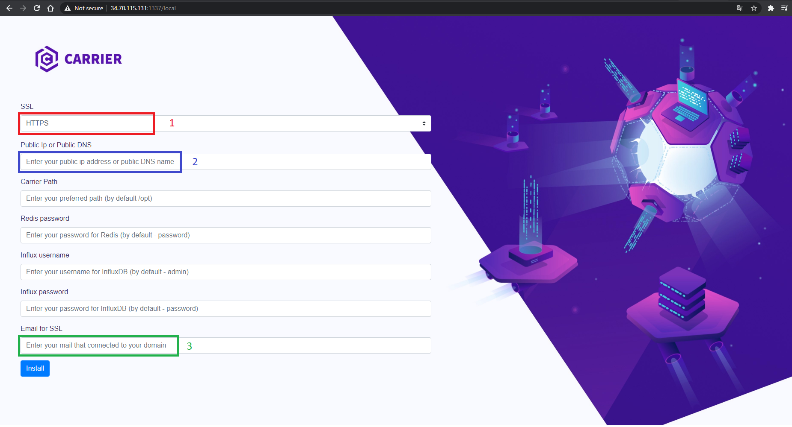

# Carrier | Installer

### Local installation:
#### Prerequisites
Make sure that you have at least 16GB of RAM on VM where you want install Carrier  
Required ports:
22, 80, 3100, 6379, 8086.

1) Install Docker.

2) Run the docker command:

``
docker run -it -v /opt:/opt -v /var/run/docker.sock:/var/run/docker.sock -p 1337:1337 getcarrier/installer:2.0
``

3) Open http://localhost:1337/ in your browser  

1. Installation with default parameters: [Your IP address will be set by network utility "dig"; Folder = /opt; Redis Password = password; Influx User = admin; Influx Password = password;]
2. Installation with Advanced Settings:  

   
3. Enter your IP address
4. Enter Path to carrier folder (must be the same with docker volume when you launch container for example: /opt:/opt  /home:/home  /yourownfolder:/yourownfolder)
5. Enter your own passwords and username

6. Status page with application logs

#### SSL installation:

Exact the same installation but with DNS name

1. Change SSL field to (HTTPS mode)
2. Enter your Domain name
3. Enter your mail that connected to your Domain

### SSH installation:
1) Run the docker command:

``
docker run -it -p 1337:1337 getcarrier/installer
``

2) Open http://localhost:1337/ in your browser  
3) Choose your preferred option

### Clouds
Will be available in 2.5 release

### Kubernetes
Under Development.
